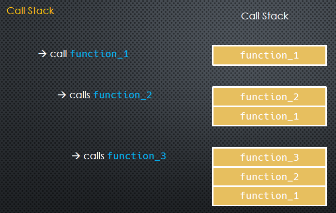
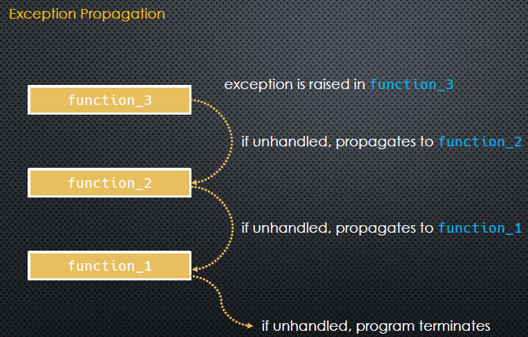

# Python Exception Handling

<link src="./assets/font/Tanha.ttf">

# <div dir="rtl" style="font-family:'operator mono lig', tanha; font-weight:300;">

<div dir="rtl" style="font-family:tanha; font-weight:300;">

## مدیریت کردن استثنائات در پایتون

سلام

می‌خوایم در مورد اکسپشن‌ها یا استثنائات در پایتون حرف بزنیم  
یکی روش‌های خوب برای اینکه یک مبحثی رو توضیح بدیم اینه که با مطرح کردن چندتا سوال یه‌جورایی یک مسیر برای صحبت‌مون ایجاد کنیم  
 و روی این مسیر پیش بریم  
سوالاتی که من مطرح کردم و سعی می‌کنم جواب بدم از این قراره:

- اکسپشن‌ها چی هستن؟  
   همون اول‌کار قطعانه بگم که اکسپشن‌ها لزوما ارور نیستن! برای مثال StopIteration Exception یک اکسپشن هست ولی ارور نیست،  
   خب ما انتظار داریم که پیمایش (Iteration) ما روی مجموعه (Collection) بلاخره تموم بشه و حالا این اکسپشن به ما میگه که تموم شده و ما باید یکاری بکنیم.

  > نکته: ما باید انتظار اکسپشن‌ها رو داشته باشیم `Expect The Exceptions`

- وقتی اکسپشن اتفاق بیافته چی میشه؟  
   در واقع با بروز اکسپشن یک زنجیره‌ای که به دنبال هندل کردن و مدیریت این اکسپشن هست شروع می‌شه که بهش میگشن Exception Propagation  
   و این یعنی اگر ما توی کدمون انتظار بروز اکسپشن رو نداشته باشیم و کاری در جهت رفع این حالت نکرده باشیم،  
   اکسپشن ما شروع می‌کنه به منتشر شدن(propagate کردن). توضیح بیشتری لازمه و در ادامه گفته میشه.

- اکسپشن‌های پایتون و سلسله مراتب کلاس‌ها
  توی پایتون همه‌چیز آبجکت هست(با یه کمی اغماض) و این یعنی هرچیزی یک نمونه(Instancse) از یک کلاس هست؛  
   همین روال برای اکسپشن‌ها هم برقراره، توی پایتون یه کلاس بیس برای اکسپشن‌ها هست(BaseException) و بقیه‌ی اکسپشن‌ها همه از این کلاس مشتق شدن  
   این ارث بری هم بی‌دلیل نیست و در ادامه می‌بینیم.

- هندل کردن اکسپشن یعنی چی؟

- آیا می‌تونیم/چرا باید یک اکسپشن ایجاد کنیم؟

- می‌تونیم کلاس اکسپشن خودمون رو بسازیم؟

---

## اکسپشن‌ها چی هستن؟

اکسپشن‌ها در واقع آبجکت‌هایی از یک کلاس هستن.  
 وقتی یک اکسپشن ایجاد میشه(Raise of Exception) یک جریان(Workflow) به وجود میاد
که بهش Propagation-Workflow می‌گن.

> حالا ما می‌تونیم این جریان رو ردزنی کنیم، یعنی ببینیم از کجا شروع میشه و علتش چی هست.

اگر در بخشی از کد که اکسپشن رخ داده، اکسپشن هندلینگ(مدیریت اکسپشن) انجام نشده باشه  
این ورک‌فلو به دنبال یه هندلینگ مناسب به سطح بالاتر برمیگرده و اگر اونجا هم هندل نشده باشه باز به سطح بالاتر میره و...  
خلاصه این ورک‌فلوها بچه‌های پیگیری هستن!  
انقدر بالاتر میرن تا بلاخره مفسر پایتون یا مثلا ژوپیتر یا هرچی که داره اون کد رو اجرا می‌کنه هندلش کنه  
این هندل کردن اگر از طرف ما(برنامه‌نویس) نباشه معمولا با تموم کردن اجرای برنامه(Termination) صورت میگیره  
این جریان رو استک‌تریس مدیریت می‌کنه؛ به این صورت که در جریان اجرای برنامه بخش‌های درحال اجرا توی استک(پشته) قرار میگیرن  
برای مثال اگر تابع یک رو اجرا کنیم و داخل این تابع تابع دو فراخوانی شده باشه، پس تابع دو اجرا میشه  
و اگر داخل تابع دو تابع سه فراخوانی شده باشه، تابع سه اجرا میشه؛ حالا اگر داخل تابع سوم یک اکسپشن رخ بده چی میشه؟  
استک‌تریس نشون میده که اکسپشن از کجا شروع شد

---

<div dir="ltr">




</div>

---

### حالا که استک‌تریس کردن به ما نشون میده جریان از کجا آب می‌خوره، پس می‌تونیم درستش کنیم؟

جواب این سوال مثبته، بله می‌تونیم جلوی کرش کردن برنامه و terminate شدن برنامه اونم بخاطر یک اکسپشن رو بگیریم  
این کار رو بهش میگن
**اکسپشن هندلینگ**

### خب در مواجهه با یک اکسپشن شناخته شده چه واکنش‌هایی می‌تونیم انجام بدیم؟

- می‌تونیم کاری کنیم که اکسپشن اصلاح بشه و برنامه همچنان ادامه پیدا کنه و متوقف نشه

- یا اینکه می‌تونیم بذاریم اکسپشن propagate‌ بشه به سطح بالاتر و اونجا هندلش کنیم، مثلا بیخیالش بشیم کلا.(pass)

- حتی می‌تونیم یک اکسپشن رو بگیریم و خودمون یک اکسپشن دیگه برگردونیم! اینم کاربردای خودش رو داره

## اما پیاده سازی این‌ها توی کد به چه صورت هست؟

<div dir="ltr">

      try is a compound statement: it has multiple clauses
      -> try
         -> except
         -> finally
         -> else

</div>

## کاربرد این اکسپشن‌ها چیه؟

- دوباره باید این نکته رو بگیم که اکسپشن‌ها ارور نیستن!

- دارن به نوعی رفتار غیرمتعارف و ناهنجار اشاره می‌کنن، رفتاری که باعث اشکال جدی میشه

- بعضی وقتام به رفتار ناهنجاری اشاره نمی‌کنن! گاهی اوقات فقط یه پیغام هستن که یه چیزی رخ داده و یکاری بکن همون مثال StopIteration.

---

## دو گروه اصلی اکسپشن در پایتون وجود داره

<div dir="ltr">

      -> Compilation Exceptions  (e.g SyntaxError)
      -> Execution Exceptions    (e.g. ValueError, KeyError, StopIteration)

</div>

تو پایتون اکسپشن‌هایی که built-in‌ هستن، یعنی تو خود پایتون تعریف شدن، از ارث‌بری و گسترش استفاده کردن  
کلاس پایه برای همه‌ی اکسپشن‌های پایتون اسمش `BaseException‌` هست.  
ولی ما از این کلاس برای نوشتن اکسپشن‌های خودمون ارث بری نمی‌کنیم؛  
هرچند که می‌تونیم اینکارو بکنیم و مانعی نداره ولی بهتره ادامه‌ی ماجرا رو هم بخونیم.

<div dir="ltr">

> see <https://docs.python.org/3/library/exceptions.html#bltin-exceptions>

</div>

<div dir="ltr">

      -> BaseException
         -> SystemExit              raised on sys.exit()
         -> KeyboardInterrupt       raised on Ctrl-C for example
         -> GeneratorExit           raised when generator or coroutine is closed
         -> Exception               everything else!

</div>

این چهار اکسپشن در واقع تاپ‌لول‌ها هستن و بقیه از این‌ها ارث‌بری کردن  
درحالت عمومی ما از کلاس Exception برای ارث‌بری و ساختن اکسپشن‌های خودمون استفاده می‌کنیم  
بخاطر اینکه اون سه‌تا دیگه مشخصا برای حالت‌های خاصی جداشدن ولی این آخری خیلی عمومی‌تر هست

<div dir="ltr">

```md
# Python's Exception Hierarchy

most of the time any exception we work with inherits from Exception

## direct subclasses of Exception include:

            • ArithmeticError --> • FloatingPointError
                                  • ZeroDivisionError
            • AttributeError
            • LookupError     --> • IndexError
                                  • Key Error
            • SyntaxError
            • RuntimeError
            • TypeError
            • ValueError
                              and more…
         exception objects are instances of these classes
```

</div>

---

حالا به این سوال جواب بدیم

## چرا اکسپشن‌ها از کلاس اکسپشن(بیس اکسپشن) ارث بری می‌کنن؟

<div dir="ltr">

```py
# Python's Exception Hierarchy
# when exceptions inherit from other exceptions:
                                                Exception
                                                   LookupError
                                                      IndexError
```

</div>

طبق این گستره که می‌بینیم میشه نتیجه گرفت:

- یک IndexError در واقع یک LookupError هست
- یک LookupError در نهایت یک Exception هست
- یک IndexError در نهایت یک Exception هست

**نکته**:

- در نتیجه‌ی این ارث‌بردن‌ها اگر ما داریم یک LookupError رو به اصطلاح کچ می‌کنیم،  
  یعنی براش یک try/except نوشته‌باشیم؛ ولی داخل این کچ که نوشتیم یک جایی یک IndexError رخ بده  
  اون وقت این IndexError هم توی اون try/except ما هندل میشه!(این میتونه خوب یا بد باشه!)

- حالا مثل همین نکته‌ی قبلی، زمانیکه ما خود Exception رو کچ کنیم  
  چون این خیلی کلی هست و همه‌ی اکسپشن‌ها ساب‌کلاس این هستن، هرچی اکسپشن که باشه اگر رخ بده  
  توی این کچ(اکسپشن هندلینگ) ما، کچ میشه! (چه هنری‌هم به خرج دادیم)

## هندل کردن اکسپشن‌ها

پایه‌ی کار برای هندل کردن اکسپشن‌ها استفاده از try/except هست  
در استفاده try به این صورت باید عمل کنیم که اون قسمتی از کد که اکسپشن رو براش پیش‌بینی می‌کنیم قرار می‌دیم  
**نکته**:
سعی کنیم مقدار کدی که داخل بلاک try قرار می‌دیم تا حد ممکن کم باشه  
ما می‌خوایم اکسپشنی که برای یک تکه‌ی کوچیک از کدمون پیش‌میاد رو هندل کنیم پس کافیه همون تکه رو تو بلاک بذاریم  
وقتی حجم زیادی از کدمون رو داخل بلاک try بذاریم پیچیدگی الکی به کدمون دادیم  
برای یک بلاک try بزرگ ممکنه موارد متعددی از اکسپشن‌ها پیش‌بیاد و تفکیک کردن این‌ها یکمی دردسره  
وقتی میایم و یک try/except می‌نویسیم یعنی میخوایم جلوی کرش‌شدن برنامه رو بگیریم  
ولی وقتی کد زیادی داخل بلاک try هست این کار سخت میشه،  
درحالیکه میشه با نوشتن چندتا بلاک try/except کد تمیزتری نوشت

<div dir="ltr">

```py
try:
   …
except ValueError:
   …
```

</div>

ما می‌تونیم به آبجکت اکسپشنی که رخ داده هم دسترسی داشته باشیم، با استفاده از کلمه‌ی کلیدی `as`:

<div dir="ltr">

```py
try:
   …
except ValueError as err:
   …
```

</div>

حالا اون `err` درواقع همون آبجکت یا اینستنس از اون کلاس اکسپشنی که انتظار داشتیم هست و داخل بلاک except بهش دسترسی داریم.

---

بریم یکمی کد ببینیم.

---

[codes ipython](./python-exceptions.ipynb)

</div>
